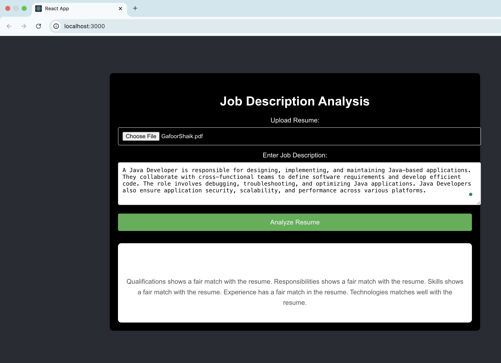

# Resume Analyzer using Hugging Face API



## Overview
This project is an AI-powered resume analyzer that helps job seekers optimize their resumes based on job descriptions. It takes a **resume** and a **job description**, analyzes them using **Hugging Face API**, and provides feedback on how well the resume aligns with the job requirements.

## Features
- 📄 **Upload Resume**: Accepts resumes in various formats (PDF, DOCX, TXT).
- 🏢 **Job Description Input**: Users can enter the job description.
- 🤖 **AI-Powered Analysis**: Uses **Hugging Face API** to compare resume keywords with job requirements.
- 📊 **Match Score**: Displays a compatibility score indicating how tailored the resume is.
- 📌 **Suggestions**: Provides recommendations to improve the resume.

## Tech Stack
- **Backend**: Spring Boot, Hugging Face API, PostgreSQL
- **Frontend**: React.js, Tailwind CSS
- **Deployment**: AWS (EC2, S3), Docker
- **Testing**: JUnit, Cypress

## Installation & Setup
### Prerequisites
Ensure you have the following installed:
- Java 17+
- Node.js & npm
- PostgreSQL
- Docker (optional for containerization)

### Backend Setup
1. Navigate to the backend folder:
   ```sh
   cd resume_backend
   ```
2. Create a `.env` file or modify `application.properties` with your Hugging Face API key.
3. Build and run the backend:
   ```sh
   mvn clean install
   mvn spring-boot:run
   ```

### Frontend Setup
1. Navigate to the frontend folder:
   ```sh
   cd resume_frontend
   ```
2. Install dependencies:
   ```sh
   npm install
   ```
3. Start the frontend:
   ```sh
   npm start
   ```

## Usage
1. Upload your resume.
2. Paste the job description.
3. Click **Analyze**.
4. View optimization suggestions.


## Future Enhancements
- Add support for more file formats.
- Generate AI-powered resume suggestions.

## Contributing
Contributions are welcome! Feel free to fork this repo and submit a PR. 🚀

## License
This project is licensed under the MIT License.
